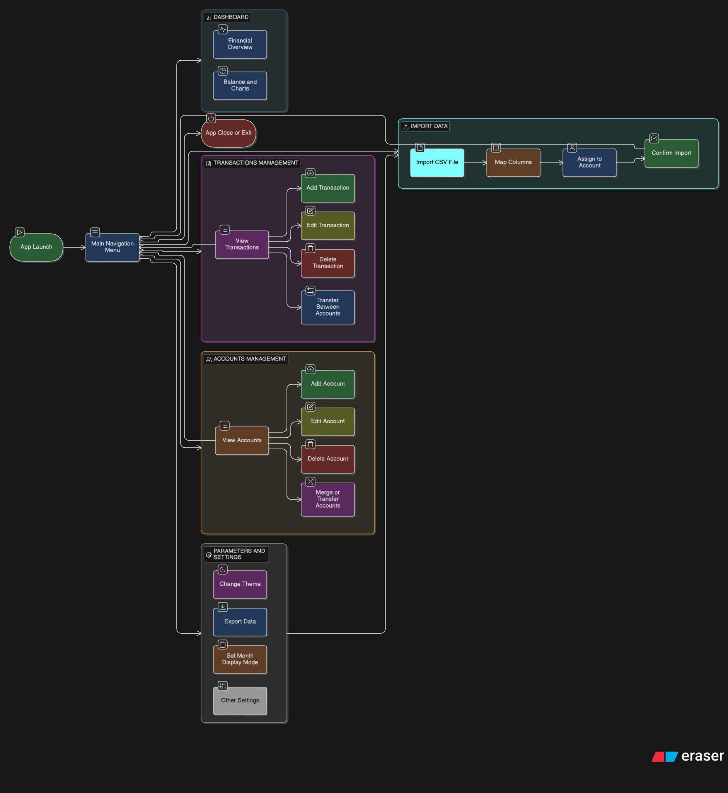

# Technical Documentation - Peadra

Welcome to the technical documentation of the **Peadra** project. This document is intended for developers wishing to understand the architecture, set up the development environment, and contribute to the project.

## 1. Overview

Peadra is a personal wealth management application built in **Python**, using the **Flet** framework for the user interface (GUI) and **SQLite** for data storage.

### Key Technologies
- **Language**: Python 3.10+
- **Interface**: [Flet](https://flet.dev/) (based on Flutter)
- **Database**: SQLite
- **Package Manager**: pip

---

## 2. Installation and Configuration

To set up the local development environment:

1.  **Clone the repository**:
    ```bash
    git clone https://github.com/your-username/peadra.git
    cd peadra
    ```

2.  **Create a virtual environment** (recommended):
    ```bash
    # Windows
    python -m venv venv
    .\venv\Scripts\activate

    # Linux/Mac
    python3 -m venv venv
    source venv/bin/activate
    ```

3.  **Install dependencies**:
    ```bash
    pip install -r requirements.txt
    ```
    
    > [!NOTE]
    > If you are a developer, also install test tools via `requirements-dev.txt`.*

4.  **Launch the application**:
    ```bash
    python main.py
    ```

---

## 3. Project Architecture

The project structure follows a logical separation of concerns (simplified MVC):

```
Peadra/
├── main.py                   # Application entry point
├── requirements.txt          # Python dependencies
├── LICENSE                   # GNU-GPL License
├── README.md                 # This file
└── src/
    ├── __init__.py
    ├── i18n.py               # Translation
    ├── components/           # Reusable UI components
    │   ├── __init__.py
    │   ├── modals.py         # Transaction and Asset modals
    │   ├── navigation.py     # Navigation rail component
    │   └── theme.py          # Theme configuration and styling
    ├── database/             # Database layer
    │   ├── __init__.py
    │   └── db_manager.py     # SQLite database manager
    └── views/                # Application views
        ├── __init__.py
        ├── accounts.py       # Accounts view
        ├── dashboard.py      # Dashboard view
        ├── import_data.py    # Import data view
        ├── parameters.py     # Parameters view
        ├── subscriptions.py  # Parameters view
        └── transactions.py   # Transactions management view
```

### Data Flow
1.  **View (`views/`)**: User interacts with the UI.
2.  **DB Call**: The view calls a method in `src.database.db_manager`.
3.  **Persistence**: `db_manager.py` executes the SQL query.
4.  **Return**: Data is returned to the view to update Flet state (`page.update()`).



---

## 4. Database (Schema)

The `peadra.db` file is automatically created on first launch. Here are the main tables as defined in `src/database/db_manager.py`:

### `categories` (accounts)
Stores expense/income categories.
- `id` (PK): Unique identifier.
- `name` (Text, Unique): Category name.
- `type` (Text): 'checking' or 'savings'.
- `color` (Hex Code): Display color.
- `created_at` (Timestamp).

### `transactions`
The core of the application, storing every financial movement.
- `id` (PK): Unique identifier.
- `date` (Date): Transaction date.
- `description` (Text): Label.
- `amount` (Real): Amount.
- `transaction_type` (Text): 'income', 'expense', 'transfer'.
- `category_id` (FK): Link to `categories.id`.
- `notes` (Text): Optional remarks.
- `created_at` / `updated_at` (Timestamp).

### `recurring_transactions`
Manages subscriptions and repeating transactions.
- `id` (PK): Unique identifier.
- `description` (Text): Subscription label.
- `amount` (Real): Expected amount.
- `transaction_type` (Text): 'income' or 'expense'.
- `start_date` (Date): When the recurrent transaction begins.
- `end_date` (Date): Optional end date for the recursion.
- `frequency` (Text): Recurrence pattern ('daily', 'weekly', 'monthly', 'yearly').
- `interval` (Integer): Multiplier for the frequency (e.g., every 1 month).
- `next_due_date` (Date): Next calculated payment date.
- `category_id` (FK): Link to `categories.id`.
- `active` (Integer): Flag (1=active, 0=inactive).

### `imported_files`
History of imported files to avoid duplicates during CSV imports.
- `id` (PK).
- `file_hash` (Text): Unique hash of file content.
- `filename` (Text): Original filename.
- `imported_at` (Timestamp).

### `settings`
Global application settings (key-value).
- `key` (PK, Text): Configuration key (e.g., 'theme_mode').
- `value` (Text): Associated value (e.g., 'dark').

---

## 5. Development Guide

### Adding a New View (Page)
To add a new page to the application (e.g., `ReportsView`):

1.  **Create the view**: Add a file in `src/views/` (e.g., `reports.py`). Create a class with a `build(self)` method that returns a Flet component (often a `ft.Column` or `ft.Container`).
2.  **Register the view**:
    - Open `main.py`.
    - Import your class: `from src.views.reports import ReportsView`.
    - In the `_init_components` method, add the instance to the `self.views` dictionary with a new index (e.g., `4`).
    ```python
    self.views = {
        # ... existing ...
        4: ReportsView(self.page, self.is_dark, self._refresh_all_views),
    }
    ```
3.  **Add to navigation**:
    - Open `src/components/navigation.py`.
    - Add a destination (`NavigationRailDestination`) in the list of destinations to match your new index.
4. **Translate**: Add every displayed text's translations in the `i18n` file.

### Modifying the Theme
The theme is centralized in `src/components/theme.py`.
- The application supports Light and Dark modes.
- Modify the `PeadraTheme` class to adjust global color palettes.
- The user choice is persisted in the `settings` table.

---

## 6. Tests

Tests are located in the `tests/` folder.

To run unit tests:
```bash
python.exe -m pytest 
```
Ensure you have installed test dependencies (`pip install pytest`).
