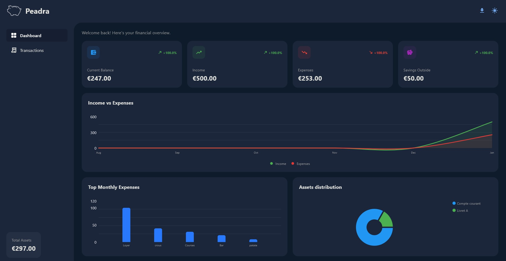
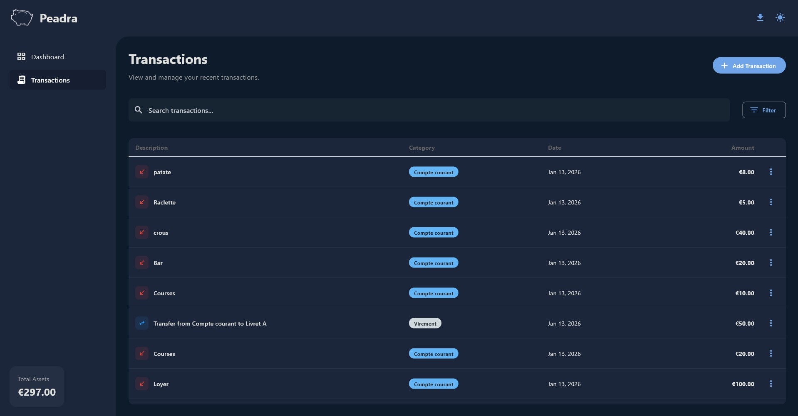

<p align="center">
  
  <h1 align="center">Peadra</h1>
</p>

Peadra (*"wealth" in Breton*) is a desktop application designed to help you track and manage your personal finances and assets.

**🚧 Early phase of the project 🚧**

## Screenshots

|                 Dashboard                 |                Transactions page               |
| :---------------------------------------: | :--------------------------------------------: |
|  |  |

## Features

- View your current balance, assets distribution and evolution
- Add, modify and delete transactions
- Organize into categories

>To come : More graphs, subscriptions views, invests page.

## Installation

### Prerequisites
- Python 3.8 or higher
- pip (Python package manager)

### Setup

1. Clone the repository:
```bash
git clone https://github.com/Arthurfert/Peadra.git
cd Peadra
```

2. Create a virtual environment (*recommended*):
```bash
python -m venv venv
source venv/bin/activate  # On Windows: venv\Scripts\activate
```

3. Install dependencies:
```bash
pip install -r requirements.txt # Or requirements-dev.txt for pytests and linting
```

4. Run the application:
```bash
python main.py
```

## Project Structure

```
Peadra/
├── main.py                 # Application entry point
├── requirements.txt        # Python dependencies
├── LICENSE                 # MIT License
├── README.md              # This file
└── src/
    ├── __init__.py
    ├── components/        # Reusable UI components
    │   ├── __init__.py
    │   ├── modals.py      # Transaction and Asset modals
    │   ├── navigation.py  # Navigation rail component
    │   └── theme.py       # Theme configuration and styling
    ├── database/          # Database layer
    │   ├── __init__.py
    │   └── db_manager.py  # SQLite database manager
    └── views/             # Application views
        ├── __init__.py
        ├── dashboard.py   # Dashboard view
        ├── transactions.py # Transactions management view
```

## License

This project is licensed under the MIT License - see the [LICENSE](LICENSE) file for details.

## Contributing

Contributions are welcome! Please feel free to submit a Pull Request.

1. Fork the repository
2. Create your feature branch
3. Make your changes !
5. Open a Pull Request

## Acknowledgments

- Built with [Flet](https://flet.dev/) - A framework for building interactive multi-platform applications in Python
