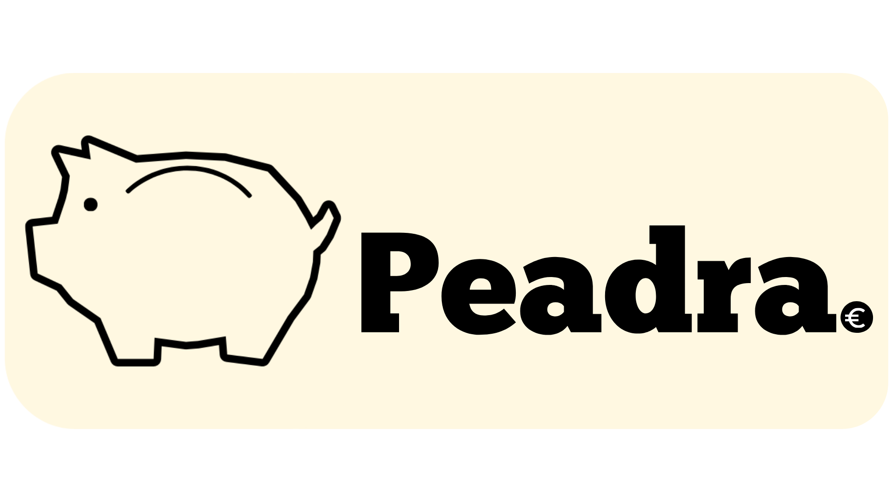
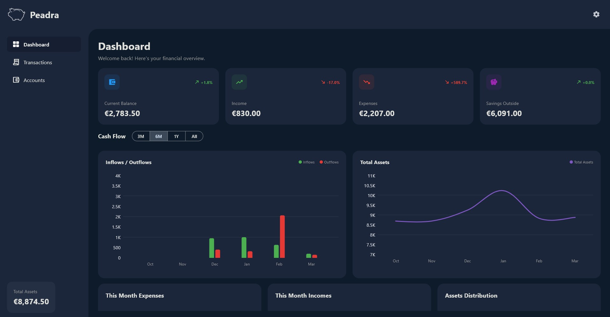
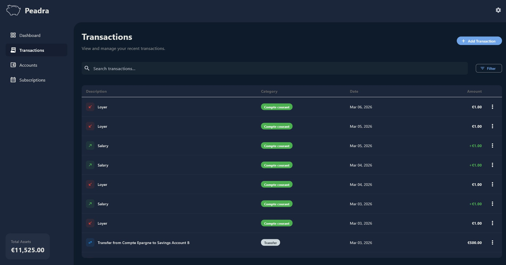
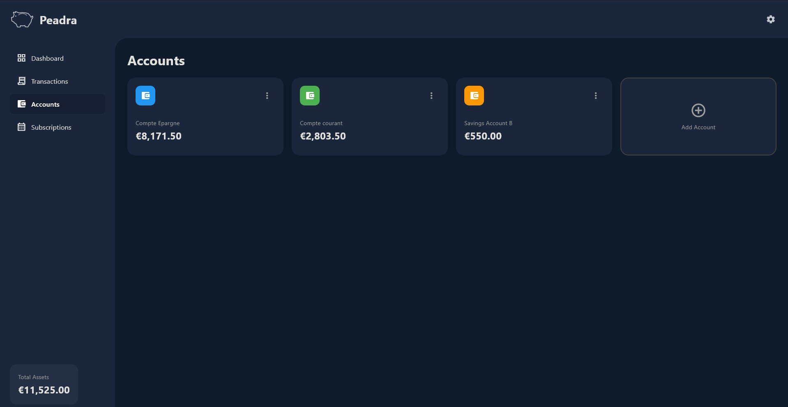
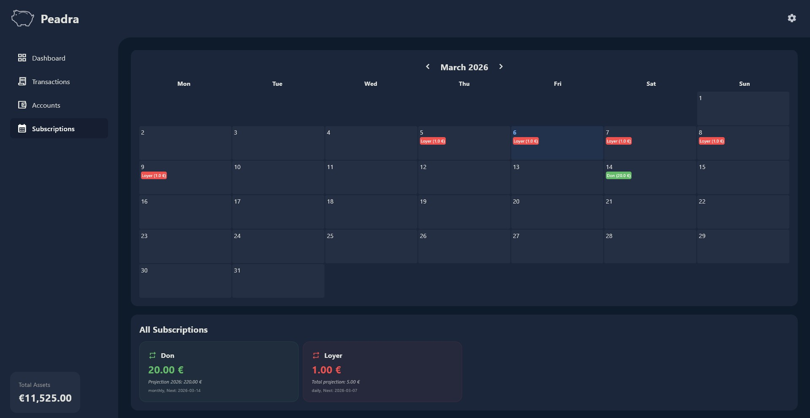

<div align="center">
  
</div>

## Screenshots

|                 Dashboard                 |                  Transactions                  |
| :---------------------------------------: | :--------------------------------------------: |
|  |  |

|                  Accounts                 |                   Subscriptions                  |
| :---------------------------------------: | :----------------------------------------------: |
|    |  |

## Overview

Peadra (*"wealth" in Breton*) is a desktop application designed to help you track and manage your personal finances and assets.

## Features

- View your current balance, assets distribution and evolution
- Add, modify and delete transactions
- Add, modify and delete your accounts
- View recurring transactions and subscriptions
- Import data from CSV files, export in JSON & CSV
- Multi accounts & authentification
- French translation

> A lot of features [to come](TODO.md) !

## Technologies

- UI : **Flet** (*Python library based on Flutter*)
- Backend : **Python** (*3.10 or higher*)
- Database : **SQLite** (*All your data is stored locally, and your the only one having access to it !*)

## Install

Download the executable file (**Windows & Linux**) on the release section on your right !

For developers or MacOS users *(I don't have one so I can't package it for you)*, please refer to [the install tutorial](./INSTALLATION.md).

## Project Structure

```
Peadra/
├── main.py                   # Application entry point
├── requirements.txt          # Python dependencies
├── LICENSE                   # GNU-GPL License
├── README.md                 # This file
└── src/
    ├── __init__.py
    ├── i18n.py               # Translation
    ├── components/           # Reusable UI components
    │   ├── __init__.py
    │   ├── modals.py         # Transaction and Asset modals
    │   ├── navigation.py     # Navigation rail component
    │   └── theme.py          # Theme configuration and styling
    ├── database/             # Database layer
    │   ├── __init__.py
    │   └── db_manager.py     # SQLite database manager
    └── views/                # Application views
        ├── __init__.py
        ├── accounts.py       # Accounts view
        ├── dashboard.py      # Dashboard view
        ├── import_data.py    # Import data view
        ├── parameters.py     # Parameters view
        ├── subscriptions.py  # Parameters view
        └── transactions.py   # Transactions management view
```

> [!NOTE]
> To learn more about how Peadra works under the hood, please have a look to the [documentation](./DOCUMENTATION.md) !

## License

This project is licensed under the GNU-GPL License - see the [LICENSE](LICENSE) file for details.

## Acknowledgments

- Built with [Flet](https://flet.dev/) - A framework for building interactive multi-platform applications in Python
