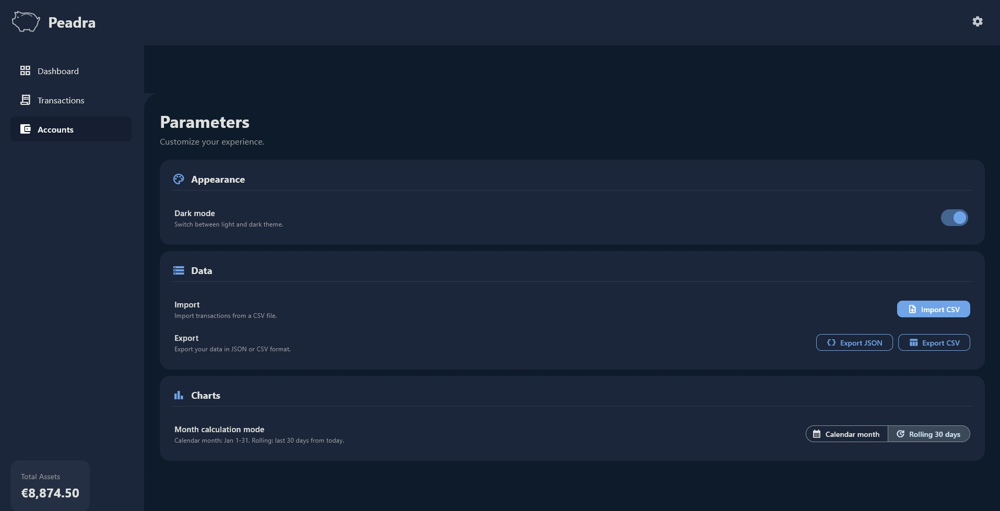

<div align="center">
  
</div>

## Screenshots

|                 Dashboard                 |                  Transactions                  |
| :---------------------------------------: | :--------------------------------------------: |
|  |  |

|                  Accounts                 |                   Parameters                   |
| :---------------------------------------: | :--------------------------------------------: |
|    |     |

## Overview

Peadra (*"wealth" in Breton*) is a desktop application designed to help you track and manage your personal finances and assets.

## Features

- View your current balance, assets distribution and evolution
- Add, modify and delete transactions
- Add, modify and delete your accounts
- Import data from CSV files, export in JSON & CSV

>To come : subscriptions view, and [more](TODO.md)

## Technologies

- UI : **Flet** (*Python library based on Flutter*)
- Backend : **Python**
- Database : **SQLite** (*All your data is stored locally, and your the only one having access to it !*)

## Installation

### Prerequisites
- Python 3.10 or higher
- pip (Python package manager)

### Setup

1. Clone the repository: (if you don't have git, download the zip file)
```bash
git clone https://github.com/Arthurfert/Peadra.git
cd Peadra
```

2. Create a virtual environment (*recommended*):
```bash
python -m venv venv
source venv/bin/activate  # On Windows: venv\Scripts\activate
```

3. Install dependencies:
```bash
pip install -r requirements.txt # Or requirements-dev.txt for pytests and linting
```

4. Run the application:
```bash
python main.py
```

> For Ubuntu users, you might need to install the following dependencies:
>```bash
>sudo apt install libmpv1
>```
>If it doesn't work, try fixing it with this [stack overflow post](https://stackoverflow.com/questions/78007193/error-while-loading-shared-libraries-libmpv-so-1-cannot-open-shared-object-fil).

## Build

### Windows

Prerequisites : 
- Visual Studio with C/C++
- On windows, you will need developers mode enabled 

```bash
flet build windows
```

### Linux

```bash
flet build linux
```

### MacOS

Prerequisites : 
- Rosetta 2 (for packaging)
- Xcode (to compile swift or objective-C code)
- CocoaPods (install and compile flutter plugins)

```bash
flet build macos
```

## Project Structure

```
Peadra/
├── main.py                 # Application entry point
├── requirements.txt        # Python dependencies
├── LICENSE                 # MIT License
├── README.md               # This file
└── src/
    ├── __init__.py
    ├── components/         # Reusable UI components
    │   ├── __init__.py
    │   ├── modals.py       # Transaction and Asset modals
    │   ├── navigation.py   # Navigation rail component
    │   └── theme.py        # Theme configuration and styling
    ├── database/           # Database layer
    │   ├── __init__.py
    │   └── db_manager.py   # SQLite database manager
    └── views/              # Application views
        ├── __init__.py
        ├── accounts.py     # Accounts view
        ├── dashboard.py    # Dashboard view
        ├── import_data.py  # Import data view
        ├── parameters.py   # Parameters view
        └── transactions.py # Transactions management view
```

## License

This project is licensed under the MIT License - see the [LICENSE](LICENSE) file for details.

## Acknowledgments

- Built with [Flet](https://flet.dev/) - A framework for building interactive multi-platform applications in Python
