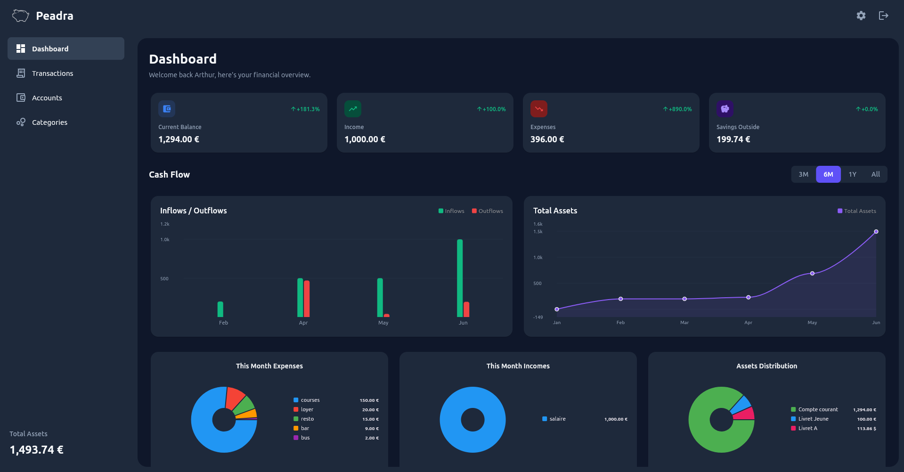
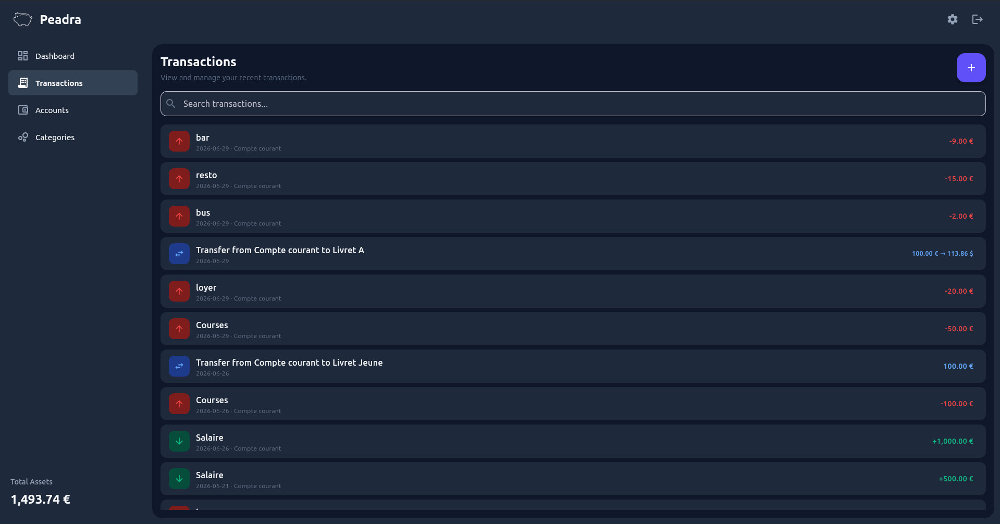
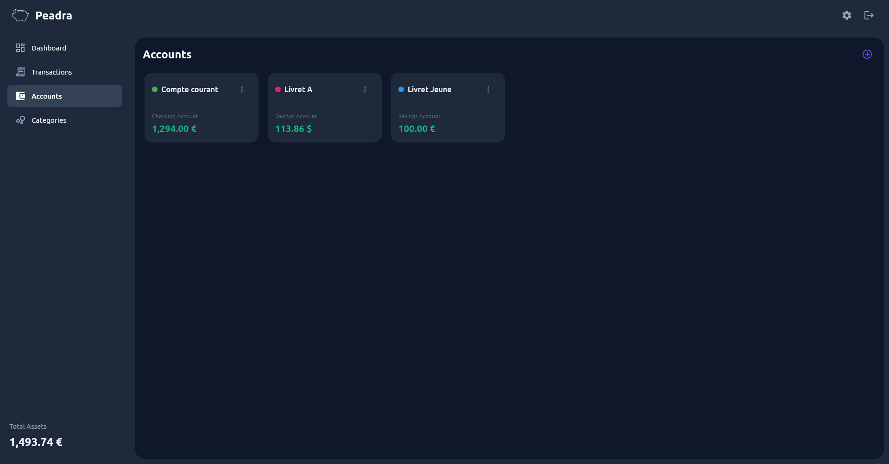
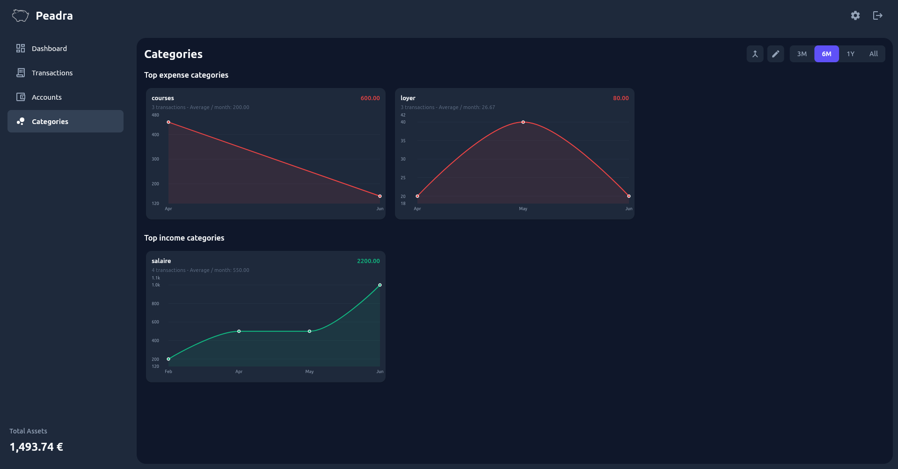

<div align="center">
  
</div>

<div align="center">
  <a href="https://deepwiki.com/Arthurfert/Peadra"></a>
  <a href="https://github.com/Arthurfert/Peadra?tab=GPL-3.0-1-ov-file)"></a>
  
</div>

## Screenshots

|                 Dashboard                 |                  Transactions                  |
| :---------------------------------------: | :--------------------------------------------: |
|  |  |

|                  Accounts                 |                 Subscriptions               |
| :---------------------------------------: | :-----------------------------------------: |
|    |  |

## Overview

Peadra ("*wealth*" in Breton) is a secure, privacy-focused cross-platform application designed to streamline personal finance and asset management.

Built with **Flutter & Dart**, it runs natively on **Linux and Windows** - *Android, iOS and MacOS support will arrive*.  
Your financial data stays 100% local.  
Track your assets, manage transactions across multiple accounts and currencies, and keep full control of your finances.

## Features

**Portfolio & Asset Management**
- Track your current balance, asset distribution, and financial evolution over time.
- Bar charts, pie charts, and line charts for visual insights into spending patterns and trends.
- Organize transactions into categories with the ability to dynamically rename, merge, and restructure them.
- Monitor recurring transactions and active subscriptions at a glance.

**Account & Transaction Management**
- Easily add, modify, or delete transactions (expense, income, transfer), in any of 36 supported currencies with automatic exchange rate conversion.
- Manage multiple distinct accounts with independent tracking and color coding.
- Secure access control for different users on the same device, with SHA-256 password hashing.
- Transaction descriptions are auto-suggested from your history as you type.

**Data Control & System**
- Powered by a local SQLite database. Your financial data never leaves your machine.
- Seamlessly import data via CSV files with automatic column detection and dialect parsing, and export your history in both JSON and CSV formats.
- Adaptive layout that works beautifully on phones, tablets, and desktops.
- Four built-in themes - Light, Dark, Autumn, and Summer.

**Supported platforms:** Linux, Windows, *Android*. (The Apple ecosystem is theoretically supported, but has'nt been tested).  
**Supported languages:** English, French.

> ...and many more features [to come](TODO.md) !

## Install

To install the app, please download your designated installer in the `Release` section (Linux and Windows).

> [!NOTE]
> For **Windows users**, you will need to download and install the `peadra.cer` file (certificates for windows to trust Peadra).

For developper's setup instructions, see [INSTALLATION.md](./INSTALLATION.md).

## Technologies

- **UI Framework:** [Flutter](https://flutter.dev/) - Google's cross-platform UI toolkit for natively compiled apps
- **Language:** [Dart](https://dart.dev/) (version 3.5+)
- **Database:** [sqflite](https://pub.dev/packages/sqflite) - SQLite for Flutter

## Project Structure

```
Peadra/
├── pubspec.yaml                       # Flutter/Dart dependencies
├── lib/
│   ├── main.dart                      # App entry point
│   ├── core/                          # Shared infrastructure
│   │   ├── database/
│   │   │   └── database_manager.dart  # SQLite database layer
│   │   ├── models/                    # Data models (User, Account, Transaction…)
│   │   ├── services/                  # Auth, currency, import, export, update
│   │   ├── providers/                 # State management (Provider)
│   │   ├── i18n/                      # Translations (EN/FR)
│   │   ├── theme/                     # Color schemes & theming
│   │   ├── utils/                     # Constants, formatters
│   │   └── responsive/                # Layout breakpoints (phone/tablet/desktop)
│   ├── features/                      # Feature-first modules
│   │   ├── auth/presentation/
│   │   │   └── login_view.dart
│   │   ├── dashboard/presentation/
│   │   │   ├── charts/                # Shared chart widgets
│   │   │   ├── dashboard_shell.dart   # Entrypoint → LayoutBuilder
│   │   │   ├── dashboard_shell_desktop.dart
│   │   │   ├── dashboard_shell_mobile.dart
│   │   │   ├── dashboard_view.dart    # Entrypoint → LayoutBuilder
│   │   │   ├── dashboard_view_desktop.dart
│   │   │   └── dashboard_view_mobile.dart
│   │   ├── transactions/presentation/
│   │   │   ├── transactions_view.dart
│   │   │   └── widgets/transaction_modal.dart
│   │   ├── accounts/presentation/
│   │   │   └── accounts_view.dart
│   │   ├── categories/presentation/
│   │   │   └── categories_view.dart
│   │   ├── parameters/presentation/
│   │   │   └── parameters_view.dart
│   │   └── import_data/presentation/
│   │       └── import_data_view.dart
│   └── shared/widgets/
│       └── peadra_notification.dart
├── android/                           # Android platform files
├── ios/                               # iOS platform files
├── linux/                             # Linux platform files
├── windows/                           # Windows platform files
├── macos/                             # macOS platform files
└── assets/                            # Images, icons
```

**Adaptive pattern:** Screens with fundamentally different layouts use a
`LayoutBuilder` entrypoint that delegates to separate desktop/mobile files.
These share all business logic and state from the parent widget, keeping
platform-specific UI isolated without code duplication. Smaller responsive
tweaks (grid columns, padding) stay inline. The dashboard above illustrates
this pattern — other features follow the same approach where needed.

## License

This project is licensed under the GNU-GPL License - see the [LICENSE](LICENSE) file for details.

## Acknowledgments

- Built with [Flutter](https://flutter.dev/) — Google's UI toolkit for building natively compiled applications
